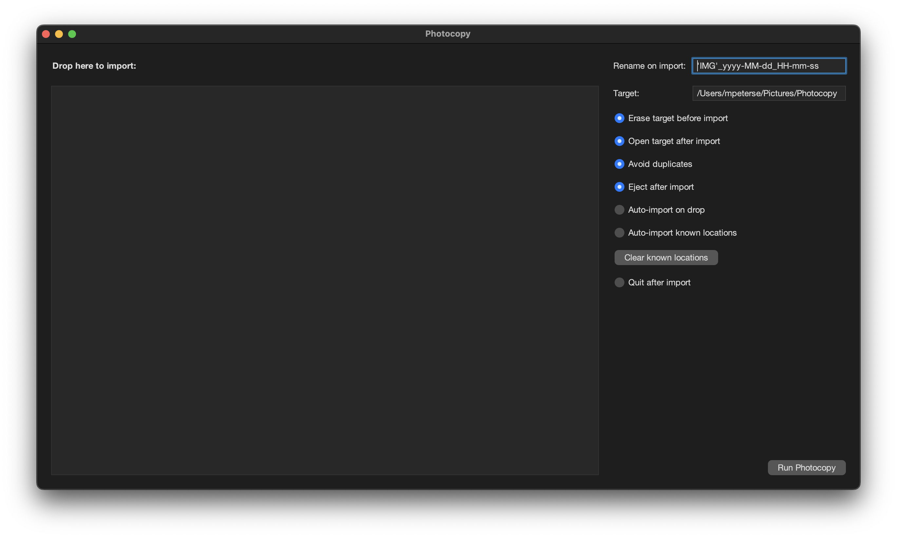

# Photocopy

## Usage

Photocopy can be used either as a command line application or as a macOS application in the menubar. 

### Command line application

Create a configuration file in `~/.photocopy/config.json`. The file needs to have the following structure:

```json
{
  "target" : "/path/to/target/directory",
  "openAfterCopy" : true,
  "renameOnCopy" : "'IMG'_yyyy-MM-dd_HH-mm-ss",
  "eraseBeforeCopy" : true,
  "ejectAfterCopy" : true
}
```

| Field    | Description                         |
|----------|-------------------------------------|
| `target` | The path of the target directory.   |
| `openAfterCopy` | If `true` then the target directory will be opened after copy. |
| `renameOnCopy` | The format string to rename the file on copy. Needs to be compatible with a Java date format pattern. |
| `eraseBeforeCopy` | If `true`then the target directory will be erased before copy. |
| `ejectAfterCopy` | If `true` then the device is ejected after copy. Not supported on the command line. |

### macOS application



The macOS application lives in the menubar and everything can be configured in the menu.

Click on the mounted device to start the copy process.

When the "Shift" key is pressed, and the mounted device or the target directory is selected, then it is opened.

## Use Photocopy in your application

Add the following dependency:

```
<dependency>
    <groupId>de.moritzpetersen</groupId>
    <artifactId>photocopy</artifactId>
    <version>1.0</version>
</dependency>
```

Add the following repository:

```
<repositories>
    <repository>
        <id>moritz-petersen-maven-repo-releases</id>
        <url>http://maven.moritzpetersen.de/releases</url>
    </repository>
</repositories>
```

## Build and Install Photocopy

The easiest way to build Photocopy is to use the makefile:

```
make
```

The makefile will build and compile the application (`make build`) and also install a symlink at `/usr/local/bin/photocopy` (`make install`).

The `target` directory will also contain a macOS application `target/Photocopy.app`.

You may need to sign the application in order to run properly (especially on Apple Silicon machines). You can use
the `bin/sign.sh` script:

```
bin/sign.sh target/Photocopy.app
```
