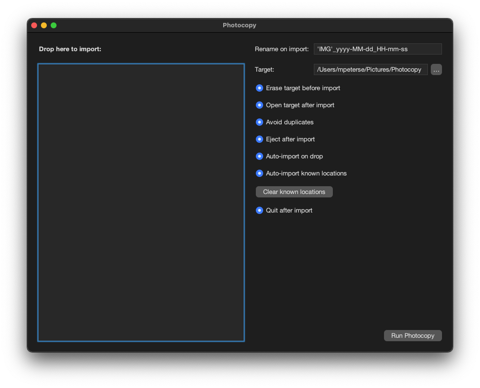

# ${project.name}

${project.name} is an application that helps you with your photography workflow. It imports photos from your camera or SD card and renames them on the fly.

My usual workflow was that I imported photos directly in Adobe Lightroom (Classic), then renamed photos by their capture date. Now I switched to Lightroom Desktop, which does not have a rename feature. I can still rename photos, when they are synched with Lightroom Classic, but I want to skip that step. ${project.name} helps me with that. It renames the photos, copies them to my hard drive and also ejects the SD card after copy.

## Usage



The right side of the window shows the configuration parameters:

| Parameter | Description
| --------- | -----------
| Rename on input | Rename each imported photo using the create date.
| Target | Enter the path to the target directory. Alternatively, drop the target directory here or chose the target directory using the `...` button.
| Erase target before import | Remove the target directory before the import process.
| Open target after import | Open the directory in finder after the import is finished.
| Avoid duplicates | Do not import photos twice. This option creates a `photocopy.json` file on the SD card which stores the already imported photos.
| Eject after import | Eject the SD card after import.
| Auto-import on drop | Immediately start importing when the source is dropped.
| Auto-import known locations | A known location is a path of a SD card or camera that has been imported before. If this path exists, automatically import when the application starts.
| Clear known locations | Forget all previously imported paths.
| Quit after import | Automatically quit the application after the import completes.


The left side shows the list of photos to import. Initially the list is empty. Drop the SD card here to import.


## Build and Install ${project.name}

The easiest way to build ${project.name} is to use the makefile:

```
make
```

The makefile will build and compile the application (`make build`) and also install the Application in the `/Applications` folder (`make install`).

### Self signing

In order to run properly on your machine (especially on an Apple Silicone Mac), you need to self sign the application. `make build` already does this for you.